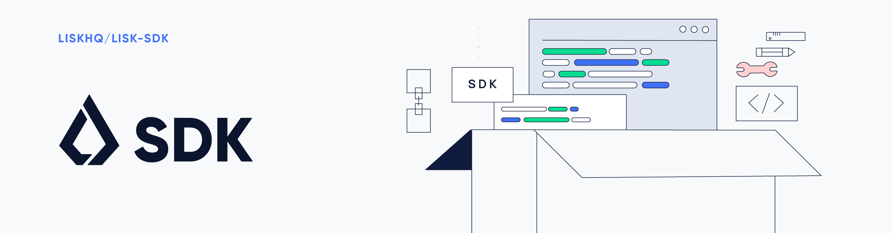
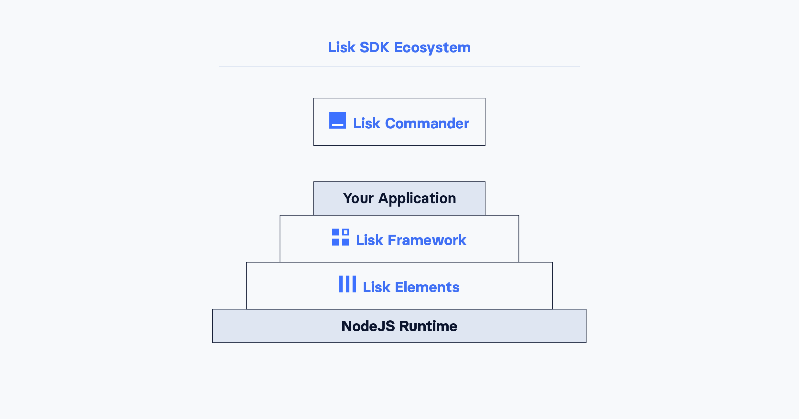

# Phaeton SDK

[](http://www.apache.org/licenses/LICENSE-2.0)
[](https://gitter.im/PhaetonHQ/phaeton-sdk?utm_source=badge&utm_medium=badge&utm_campaign=pr-badge&utm_content=badge)

## Alpha phase

Please read this carefully. With this repository we have opened access to the alpha release of the Phaeton SDK. We have released the Phaeton SDK in its current form in order for us to improve the development experience through community feedback and contributions.

We strictly discourage anyone from using the alpha release of the Phaeton SDK for any production-based blockchain applications, i.e. a blockchain operating on a real mainnet. Over the course of the alpha phase there will be significant changes in the Phaeton protocol and implementation, which will eventually bring the accessibility and reliability to a level which is feasible for production-based blockchain applications. At this time we only recommend the Phaeton SDK for proof-of-concept blockchain applications, i.e. a blockchain operating on a fake testnet.

The only application built using the Phaeton SDK currently feasible for production usage is [Phaeton Core](https://github.com/phaetonhq/phaeton-core), the client of the Phaeton network itself.

Please be advised we cannot guarantee blockchains created with the alpha release of the Phaeton SDK will remain compatible with our planned (beta/rc) releases.

We hope you enjoy building your proof-of-concept blockchain applications using the Phaeton SDK, and shall look forward to receiving your feedback and contributions during the alpha phase.

## What is the Phaeton SDK?

The Phaeton SDK aims to provide an easy and reliable software development kit for building blockchain applications which are compatible with the [Phaeton Protocol](https://phaeton.io/documentation/phaeton-protocol). The architecture of the Phaeton SDK has been designed so that it can be extended to meet the requirements of a wide variety of blockchain application use-cases. The codebase is written entirely in JavaScript, which means for a majority of developers, no significant change of tools or mindset is required to get started. The Phaeton SDK makes every effort to allow developers to focus simply and purely on writing the code that matters to their own blockchain application, and nothing more.

## Usage

#### Dependencies

Before running Phaeton SDK, the following dependencies need to be installed in order to run applications created with the Phaeton SDK:

| Dependencies     | Version |
| ---------------- | ------- |
| NodeJS           | 10.4+   |
| PostgreSQL       | 10+     |
| Redis (optional) | 5+      |

You can find further details on installing these dependencies in our [pre-installation setup guide](https://phaeton.io/documentation/phaeton-core/setup/source#pre-install).

Mind, that you need to create a database before. The default database name is `phaeton_dev`, so for the development purposes, a command `createdb phaeton_dev` will set you up.

### Installation

The installation of Phaeton Alpha SDK is straightforward and limited to getting a single NPM package, `phaeton-sdk`, to your Node.js project:

```
npm install phaeton-sdk@alpha
```

Phaeton SDK is all-in-one package that provides you with tools to create, run and maintain blockchain applications in JavaScript.

### Set up new a blockchain application

To start, create the project structure of your blockchain application. There are no special requirements here, you can create the basic Node.js project folder structure with `npm init`.

To create a blockchain application, you need to provide an entry point of your application (like `index.js`) and set-up your network by using the modules of Phaeton SDK.

It is quite simple to have a working blockchain application, mirroring the configuration of the existing Phaeton network. This can be done by copying the following three lines of code to your `index.js`:

```js
const { Application, genesisBlockDevnet } = require('phaeton-sdk');

const app = new Application(genesisBlockDevnet);

app
	.run()
	.then(() => app.logger.info('App started...'))
	.catch(error => {
		console.error('Faced error in application', error);
		process.exit(1);
	});
```

After that you can start the application by:

```
node index.js
```

### Configure your blockchain parameters

You can also define your blockchain application parameters such as `BLOCK_TIME`, `EPOCH_TIME`, `MAX_TRANSACTIONS_PER_BLOCK` and more with an optional configurations object.

```js
const app = new Application(genesisBlockDevnet, {
    app: {
        label: 'my-blockchain-application',
        genesisConfig: {
            EPOCH_TIME: new Date(Date.UTC(2016, 4, 24, 17, 0, 0, 0)).toISOString(),
            BLOCK_TIME: 10,
            MAX_TRANSACTIONS_PER_BLOCK: 25,
        },
        ...
});
```

For a complete list of configuration options see the [phaeton-docs repo](https://github.com/PhaetonHQ/phaeton-docs/blob/development/phaeton-sdk/configuration.md).

### Register a custom transaction

You can [define your own transaction types](https://github.com/PhaetonHQ/phaeton-docs/blob/development/start/custom-transactions.md) with Phaeton-SDK. This is where the custom logic for your blockchain application lives.

Add your custom transaction type to your blockchain application by registering it to the application instance:

```js
const { Application, genesisBlockDevnet } = require('phaeton-sdk');

const MyTransaction = require('./my_transaction');

const app = new Application(genesisBlockDevnet);

app.registerTransaction(MyTransaction); // register the custom transaction

app
	.run()
	.then(() => app.logger.info('App started...'))
	.catch(error => {
		console.error('Faced error in application', error);
		process.exit(1);
	});
```

For information on creating your own custom transaction, see the [phaeton-docs repo](https://github.com/PhaetonHQ/phaeton-docs/blob/development/start/custom-transactions.md) or [follow the tutorials](https://github.com/PhaetonHQ/phaeton-docs/blob/development/start/tutorials/hello-world.md).

## Architecture Overview

The Phaeton SDK operates on the NodeJS runtime and consists primarily of an application framework (Phaeton Framework), a collection of libraries providing blockchain application functionalities (Phaeton Elements), and a powerful command-line tool (Phaeton Commander) allowing developers to manage a Phaeton node instance and interact with a Phaeton compatible network. The diagram below provides a high-level overview of the architecture:



### Packages

| Directory                | Description                                                                                                                                          |
| ------------------------ | ---------------------------------------------------------------------------------------------------------------------------------------------------- |
| [Framework](./framework) | An application framework responsible for establishing and maintaining the interactions between the modules of a Phaeton blockchain application.         |
| [Elements](./elements)   | A collection of libraries, each of them implementing some form of blockchain application functionality such as cryptography, transactions, p2p, etc. |
| [Commander](./commander) | A command line tool allowing developers to manage a Phaeton node instance and interact with a Phaeton compatible network.                                  |

## Get Involved

| Reason                           | How                                                                                            |
| -------------------------------- | ---------------------------------------------------------------------------------------------- |
| Want to chat with our community  | [Reach them on Phaeton.chat](https://phaeton.chat)                                                   |
| Want to chat with our developers | [Reach them on Gitter](https://gitter.im/PhaetonHQ/phaeton-sdk)                                      |
| Found a bug                      | [Open a new issue](https://github.com/PhaetonHQ/phaeton/issues/new)                                  |
| Found a security issue           | [See our bounty program](https://blog.phaeton.io/announcing-phaeton-bug-bounty-program-5895bdd46ed4) |
| Want to share your research      | [Propose your research](https://research.phaeton.io)                                              |
| Want to develop with us          | [Create a fork](https://github.com/PhaetonHQ/phaeton/fork)                                           |

## How to Contribute

To contribute to `phaeton-sdk`, `framework` or `elements`:

1. Clone the repository: `git clone https://github.com/PhaetonHQ/phaeton-sdk.git`

2. Install dependencies and build:
   1. `npm ci`
   2. `npm run bootstrap`
   3. `npm run build`

### Testing local changes to `phaeton-sdk/framework`

Before testing local changes to `phaeton-sdk/framework`, follow the above steps for installation/building of dependencies and then run:

1. `npx lerna link`

### Testing local changes to `phaeton-sdk/elements`

Before testing local changes to `phaeton-sdk/elements`, follow the above steps for installation/building of dependencies and then run:

1. `npx lerna link`

2. Once you have linked your local repo, everytime you make changes in `phaeton-sdk/elements` you must build packages before testing:

   a. To build all packages: `npm run build`

   b. To build specific package: `lerna run build --scope <package name>`
   Example: `lerna run build --scope phaeton-p2p`

   c. To build packages that have been modified in your branch: `lerna run build --since <branch name>`
   Example:`lerna run build --since development`

**Note:** In case you face any issues during the installation make sure you have the right version of `npm` and `node` and try to install from scratch by running,
`npm run clean:node_modules && rm -rf ./node_modules`.

### Testing your local `phaeton-sdk` in your application.

In order to link your local phaeton-sdk repository and test your application which uses `phaeton-sdk`, simply follow the steps above in your local `phaeton-sdk` repository and run `npm link phaeton-sdk` in the root of your application.

## Contributors

https://github.com/PhaetonHQ/phaeton-sdk/graphs/contributors

## Disclaimer

By using the Alpha release of the Phaeton SDK, you acknowledge and agree that you have an adequate understanding of the risks associated with the use of the Alpha release of the Phaeton SDK and that it is provided on an “as is” and “as available” basis, without any representations or warranties of any kind. To the fullest extent permitted by law, in no event shall the Phaeton Foundation or other parties involved in the development of the Alpha release of the Phaeton SDK have any liability whatsoever to any person for any direct or indirect loss, liability, cost, claim, expense or damage of any kind, whether in contract or in tort, including negligence, or otherwise, arising out of or related to the use of all or part of the Alpha release of the Phaeton SDK.

## License

Copyright 2016-2019 Phaeton Foundation

Licensed under the Apache License, Version 2.0 (the "License");
you may not use this file except in compliance with the License.
You may obtain a copy of the License at

    http://www.apache.org/licenses/LICENSE-2.0

Unless required by applicable law or agreed to in writing, software
distributed under the License is distributed on an "AS IS" BASIS,
WITHOUT WARRANTIES OR CONDITIONS OF ANY KIND, either express or implied.
See the License for the specific language governing permissions and
limitations under the License.

---

Copyright © 2016-2019 Phaeton Foundation

Copyright © 2015 Crypti

Permission is hereby granted, free of charge, to any person obtaining a copy of this software and associated documentation files (the "Software"), to deal in the Software without restriction, including without limitation the rights to use, copy, modify, merge, publish, distribute, sublicense, and/or sell copies of the Software, and to permit persons to whom the Software is furnished to do so, subject to the following conditions:

The above copyright notice and this permission notice shall be included in all copies or substantial portions of the Software.

THE SOFTWARE IS PROVIDED "AS IS", WITHOUT WARRANTY OF ANY KIND, EXPRESS OR IMPLIED, INCLUDING BUT NOT LIMITED TO THE WARRANTIES OF MERCHANTABILITY, FITNESS FOR A PARTICULAR PURPOSE AND NONINFRINGEMENT. IN NO EVENT SHALL THE AUTHORS OR COPYRIGHT HOLDERS BE LIABLE FOR ANY CLAIM, DAMAGES OR OTHER LIABILITY, WHETHER IN AN ACTION OF CONTRACT, TORT OR OTHERWISE, ARISING FROM, OUT OF OR IN CONNECTION WITH THE SOFTWARE OR THE USE OR OTHER DEALINGS IN THE SOFTWARE.
# phaeton-sdk
